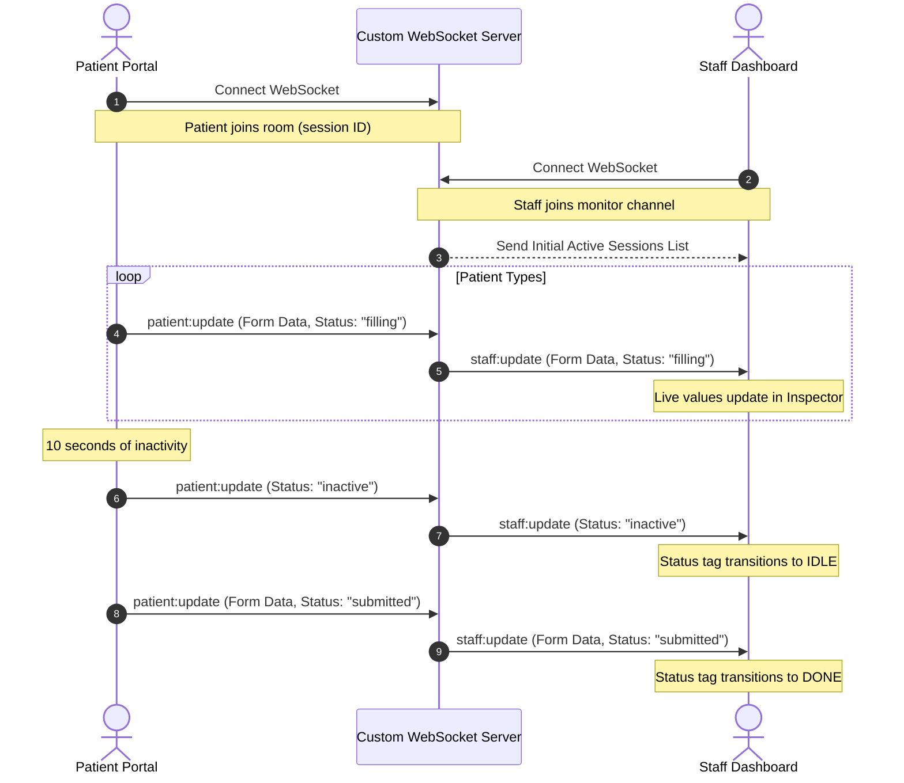

# Agnos Patient Portal & Monitor Dashboard (Real-Time Synchronization)

🔗 **Live Demo**: [https://agnos-assignment-xi.vercel.app](https://agnos-assignment-xi.vercel.app)

A responsive, real-time medical intake form and administrative monitor dashboard built with **Next.js (App Router)**, **TailwindCSS**, **TypeScript**, and **Socket.io**. It is designed to run seamlessly out-of-the-box locally, with full support for serverless environment fallbacks.

---


## 🌟 Key Features

1. **Patient Portal (`/patient`)**:
   - A modern, clean form matching all specified patient fields.
   - Built-in form validation (required checks, phone pattern check `[0-9+() \-]{8,15}`, email syntax verification, date of birth limits).
   - Custom strict letter-only validation for names, nationality, and language (restricts numbers and special symbols).
   - Instant visual feedback on validation errors using custom CSS `:user-invalid` styling (only shows errors after interaction to prevent intrusive alert layouts) and soft red background highlights.
   - Celebratory confetti explosion on successful submission.
   - Live activity detection (tracks focus/blur and typing events, resetting a 10s idle timer to keep status updated).

2. **Staff Admissions Dashboard (`/staff`)**:
   - Live administration console monitoring patient registers.
   - **Real-Time Key-by-Key Sync**: Inspect individual fields of the patient form in real-time as they type.
   - **Activity States Indicators**: Live status tags detailing patient engagement:
     - 🔵 **ACTIVE**: Patient is currently typing or editing fields.
     - 🔴 **IDLE**: Patient has left the form or has not typed for over 10 seconds.
     - 🟣 **DONE**: Patient has successfully submitted the form.
   - **Admissions Statistics**: Live counter detailing total patients, active filling, idle count, and final submissions with beautiful distinct colored card backgrounds.

3. **Dual Synchronization Engine**:
   - **WebSocket Mode (Socket.io)**: Attempts standard WebSocket routing for instantaneous, low-latency, key-by-key transmission.
   - **REST API Fallback Mode**: If the client is deployed on strict serverless hosting (e.g. Vercel or Netlify) where persistent WebSockets are unsupported, it automatically falls back to long-polling via Next.js route handlers (`/api/sync`) every 2 seconds. The client detects this and transitions gracefully with no disruption to the user experience.

---

## 🛠️ Architecture & Tech Stack

- **Framework**: Next.js 15+ (App Router)
- **Language**: TypeScript (Static typing & code safety)
- **Styling**: TailwindCSS v4 & Vanilla CSS custom enhancements (Glassmorphism panels, glowing status tags, card top accent gradients, color-coded section lines, slide-down animations)
- **Real-Time Sync**: Socket.io (WebSocket client & server wrapper)
- **Icons**: Lucide React
- **Celebration API**: Canvas Confetti

### Real-Time Synchronization Sequence



---

## 📂 Project Structure

```
agnos-assignment/
├── server.js                 # Custom Next.js + Socket.io Server entry point
├── package.json              # Configures dependencies & dev/start scripts
├── tsconfig.json             # TypeScript compiler settings
├── src/
│   ├── app/
│   │   ├── layout.js         # Core layout containing global meta tags
│   │   ├── page.tsx          # Selection page (Lobby Portal)
│   │   ├── globals.css       # Custom Glassmorphism, animations, and :user-invalid CSS rules
│   │   ├── patient/
│   │   │   └── page.tsx      # Patient registration form view (Live sync hooks)
│   │   ├── staff/
│   │   │   └── page.tsx      # Staff Monitor Dashboard (Metrics, list, real-time inspector)
│   │   └── api/
│   │       └── sync/
│   │           └── route.ts  # REST fallback endpoint (Serves cached session states)
```

---

## 🚀 Installation & Local Execution

### 1. Install Dependencies
Navigate to the project root and install node packages:
```bash
npm install
```

### 2. Run the Development Server
Start the custom server compiling Next.js pages and launching the Socket.io WebSocket server:
```bash
npm run dev
```
*Console will log: `[Server] > Ready on http://localhost:3000`*

### 3. Open the Portals
Open your browser and launch:
- **Lobby page**: `http://localhost:3000`
- **Patient view**: `http://localhost:3000/patient` (Side-by-side or on a separate tab)
- **Staff view**: `http://localhost:3000/staff` (Observe real-time updates as you type in the patient form!)

---

## 🎨 UI/UX Design Decisions

- **Color Theme**: **Vibrant Colorful Soft Light Theme** utilizing a linear pastel gradient background (`#eef3fc`, `#fef0f4`, `#f6efff`) that is lively and clinical yet low in contrast to prevent eye glare.
- **Glassmorphism**: Panels are semi-transparent (`backdrop-filter: blur()`) with subtle white border outlines (`rgba(255, 255, 255, 0.7)`) and soft shadows that give depth and responsiveness to interactions.
- **Visual Indicators**:
  - **Top Accent Bars**: A gradient indicator bar (`from-blue-500 to-pink-500`) runs along the top of primary cards for premium styling.
  - **Section Indicators**: Form fields are grouped using colorful left border lines (Blue for Identification, Pink for Contact, Purple for Demographics, Indigo for Emergency Contact) to segment input flow.
  - **Status Glows**: Active and inactive states feature distinct radial-shadow glows (`glow-dot-active`, etc.) that act as status lights, giving staff a visual hierarchy of admissions.
- **Validation**: Error labels slide down gracefully if invalid inputs lose focus or if the submit button is clicked on an incomplete form. Invalid inputs highlight in red with validation error messages.
